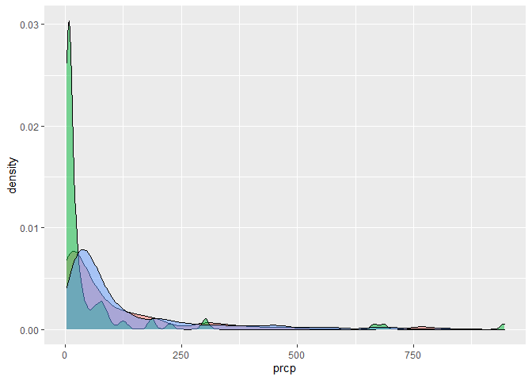

viz_part_02
================

## import data

\##getting data

``` r
weather_df = 
  rnoaa::meteo_pull_monitors(
    c("USW00094728", "USC00519397", "USS0023B17S"),
    var = c("PRCP", "TMIN", "TMAX"), 
    date_min = "2017-01-01",
    date_max = "2017-12-31") %>%
  mutate(
    name = recode(
      id, 
      USW00094728 = "CentralPark_NY", 
      USC00519397 = "Waikiki_HA",
      USS0023B17S = "Waterhole_WA"),
    tmin = tmin / 10,
    tmax = tmax / 10) %>%
  select(name, id, everything())
```

    ## Registered S3 method overwritten by 'hoardr':
    ##   method           from
    ##   print.cache_info httr

    ## using cached file: C:\Users\Hemangi\AppData\Local/Cache/R/noaa_ghcnd/USW00094728.dly

    ## date created (size, mb): 2022-10-12 22:56:05 (8.428)

    ## file min/max dates: 1869-01-01 / 2022-10-31

    ## using cached file: C:\Users\Hemangi\AppData\Local/Cache/R/noaa_ghcnd/USC00519397.dly

    ## date created (size, mb): 2022-10-12 22:56:38 (1.703)

    ## file min/max dates: 1965-01-01 / 2020-03-31

    ## using cached file: C:\Users\Hemangi\AppData\Local/Cache/R/noaa_ghcnd/USS0023B17S.dly

    ## date created (size, mb): 2022-10-12 22:56:47 (0.954)

    ## file min/max dates: 1999-09-01 / 2022-10-31

## Scatterplot

``` r
weather_df %>% 
  ggplot(aes(x = tmin, y = tmax, color = name)) +
  geom_point(alpha = .5) +
  labs(
    x = "Minimum Daily Temp (C)",
    y = "Maximum Daily Temp (C)",
    title = "Scatterplot of daily temp extremes",
    caption = "Data come from the rnoaa package"
  ) +
  scale_x_continuous(
    breaks = c(-10, 0, 15),
    labels = c("-10C","0", "15")
  ) 
```

    ## Warning: Removed 15 rows containing missing values (geom_point).

<!-- -->

``` r
ggp_weather = 
  weather_df %>% 
  ggplot(aes(x = tmin, y = tmax, color = name)) +
  geom_point(alpha = .5) +
  labs(
    x = "Minimum Daily Temp (C)",
    y = "Maximum Daily Temp (C)",
    title = "Scatterplot of daily temp extremes",
    caption = "Data come from the rnoaa package"
  ) +
  scale_color_hue(
    name = "Location",
    h= c(100,300))
```

``` r
ggp_weather +
  theme_minimal() +
  theme(legend.position = "bottom")
```

    ## Warning: Removed 15 rows containing missing values (geom_point).

<!-- -->

``` r
ggp_weather
```

    ## Warning: Removed 15 rows containing missing values (geom_point).

<!-- -->

## Data in geom()

``` r
central_park_df = 
  weather_df %>% 
  filter(name == "CentralPark_NY")

waikiki_df = 
  weather_df %>% 
  filter(name == "Waikiki_HA")

ggplot(waikiki_df, aes(x = date, y = tmax)) +
  geom_point() +
  geom_line(data = central_park_df)
```

    ## Warning: Removed 3 rows containing missing values (geom_point).

<!-- -->

## Patchwork…

``` r
tmax_tmin_plot =
  weather_df %>% 
  ggplot(aes(x = tmin, y = tmax, color = name)) +
  geom_point() +
  theme(legend.position = "none")

prcp_density_plot = 
  weather_df %>% 
  filter(prcp > 0) %>% 
  ggplot(aes(x = prcp, fill = name)) +
  geom_density(alpha = .5) +
  theme(legend.position = "none")

tmax_tmin_plot
```

    ## Warning: Removed 15 rows containing missing values (geom_point).

<!-- -->

``` r
prcp_density_plot
```

<!-- -->

``` r
tmax_tmin_plot + prcp_density_plot
```

    ## Warning: Removed 15 rows containing missing values (geom_point).

<!-- -->

## Data manipulation

``` r
weather_df %>% 
  mutate(name = fct_relevel(name, "Waikiki_HA")) %>% 
  ggplot(aes(x = name, y = tmax)) +
  geom_boxplot()
```

    ## Warning: Removed 3 rows containing non-finite values (stat_boxplot).

<!-- -->

``` r
pulse_df = 
  haven::read_sas("data/public_pulse_data.sas7bdat") %>% 
  janitor::clean_names() %>% 
  pivot_longer(
    bdi_score_bl:bdi_score_12m,
    names_to = "visit",
    values_to = "bdi",
    names_prefix = "bdi_score_"
    
  ) %>% 
  select(id, visit, everything()) %>% 
  mutate(
    visit = fct_relevel(visit, "bl")
  )

pulse_df %>% 
  ggplot(aes(x = visit, y = bdi)) +
  geom_boxplot()
```

    ## Warning: Removed 879 rows containing non-finite values (stat_boxplot).

<!-- -->
